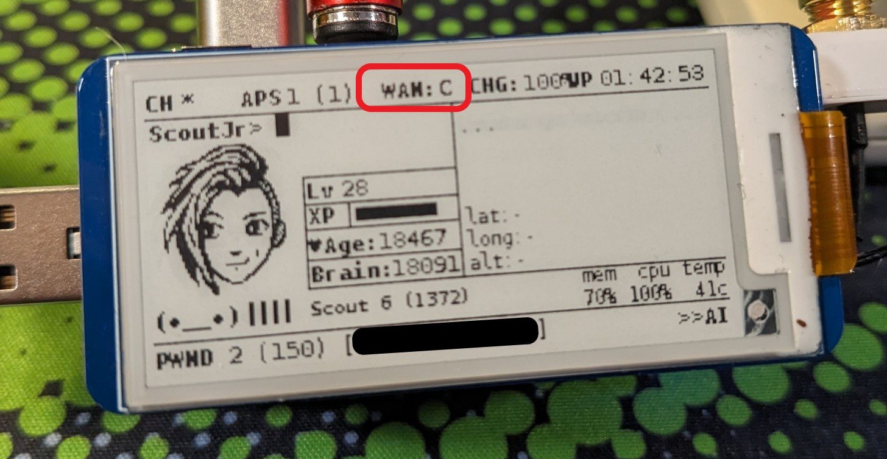

# pwnagotchi-plugin-wanmon

A simple Pwnagotchi plugin to detect WAN(Internet or Intranet) connection and report it on the display.

# Overview
### Why?
I built this plugin to speed up my troubleshooting when I dock my Pwnagotchi. Every time I connected the Pwnagotchi to my laptop or a Pi0 dock, I found myself having to test if the IP config was the issue or if DNS was not working. So, this was my way of quickly knowing what to fix.

### What does it do?
WanMon tests the network connection by sending a single ping packet(ICMP) to the IP configured, then does the same with the domain name configured. 

 - If the IP ping AND domain name ping get responses, the status on display is "**C**" as in connected.
 - If the IP ping gets a response, but the domain name ping does NOT, the status on display is "**IP**" as in the IP is working, but not DNS.
 - If neither IP AND domain name pings get a response, the status is "**X**".

#### Hay, wait, why not just use the built-in "on_internet_available()" function in the Pwnagotchi API?
So glad you asked! =P
The Pwnagotchi's plugin API has the "on_internet_available()" function. This is triggered when the system can open a connection to "pwnagotchi.ai:443". So, the "on_internet_available()" will only trigger if you have a fully working DNS and Internet connection. This function is only sometimes helpful since we may only need to confirm if the Pi0 has an internal networking connection.

# Install
**Requirements:** Nothing, but WanMon does need to be able to see and use "/bin/ping".

The installation is straightforward. The only tricky part may be getting the on-screen display placed where you like. I have included the "config.toml" file I used with my Wavesharev3 screen(as seen in the image above). You may need to tweak it to get it to work for you.
1. Copy the  "wanmon.py" file to your plugin folder on your Pwnagotchi.
2. Copy the contents of the "config.toml" file into the Pwnagotchi's "config.toml" file.
3. Update the WanMon plugin in the Pwnagotchi config to match your preferences.
4. Restart the Pwnagotchi

